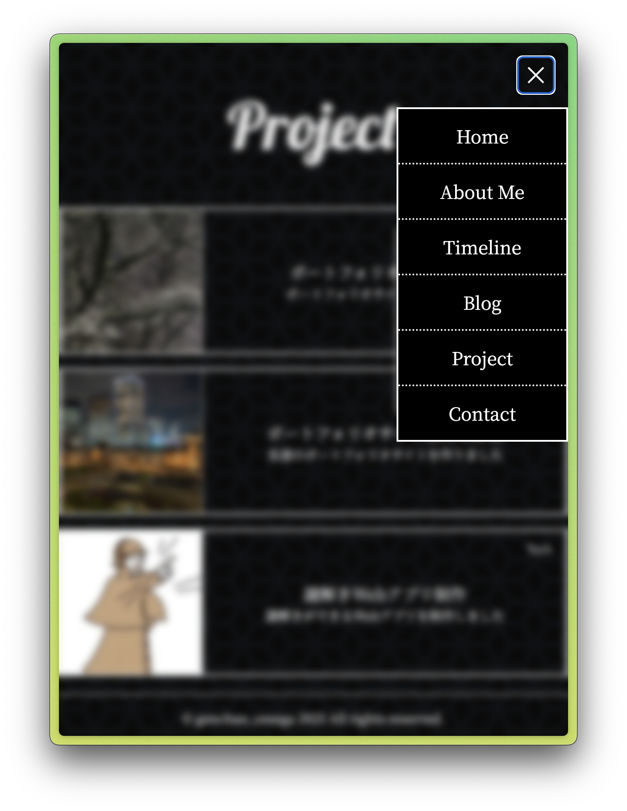

# この記事の内容
この記事を読むと，以下の1点について理解できます．
- Next.jsでサイトにアイテムを配置する方法

# 雑談
各記事の初めに少し余談を挟むことで，ブログ記事を読むハードルを下げようという試みです．

これまで，ポートフォリオサイトを一から作るための記事を懇切丁寧に書くつもりでしたが，以下の理由からそれはストップしました．

- 需要がない(そういう記事はすでにごまんと出回っている)
- 自分がサイト制作してから時間が経ってしまったことで，そのときの困難を忘れてしまっている

そのため，以降の記事ではサイト制作した際にひどく躓いた，印象深い部分に絞って記録していこうと思います．これに伴い，ブログの内容自体もかなり噛み砕いたものとなる予定です．

# タグが前に来てくれない事件
一つ目のテーマとして，要素の重なり順を制御することがとても難しかった記録を残します．普段見ているサイトは，(背景を除いても)基本的に何かの上に何かを重ねて表示しています．例えば，このサイトの右上に鎮座しているハンバーガーメニュー(「三」みたいなやつ)がその代表です．実際にクリックしてみると，このように全ての前に表示されます．

ここで，実は重なっているコンテンツ部分とハンバーガーメニューの間に見えない壁を仕込んでいます．
